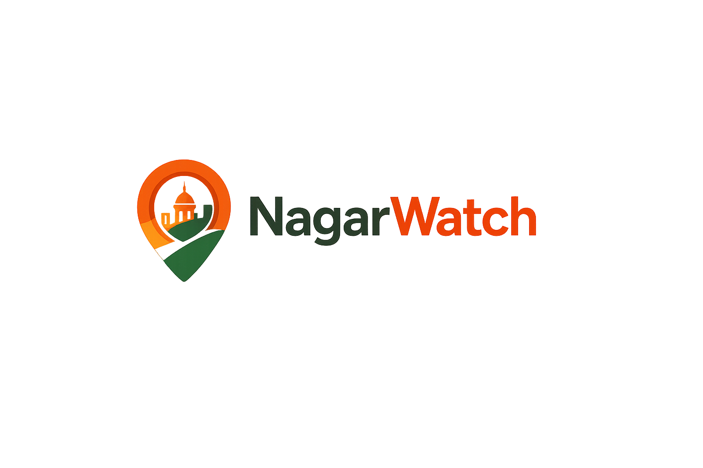
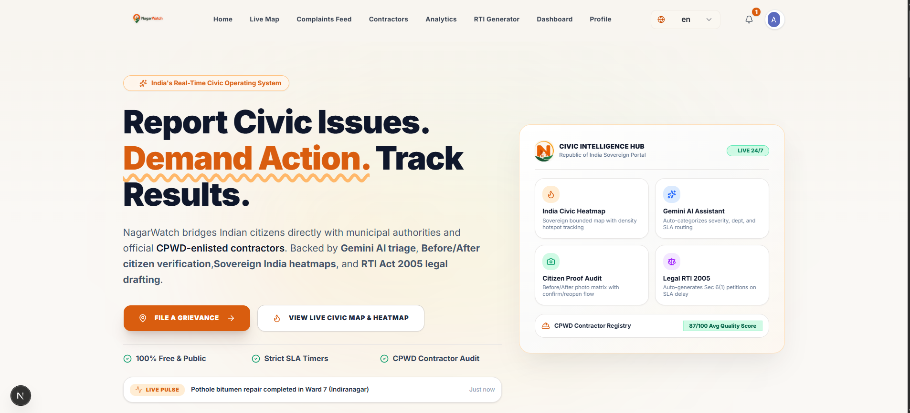
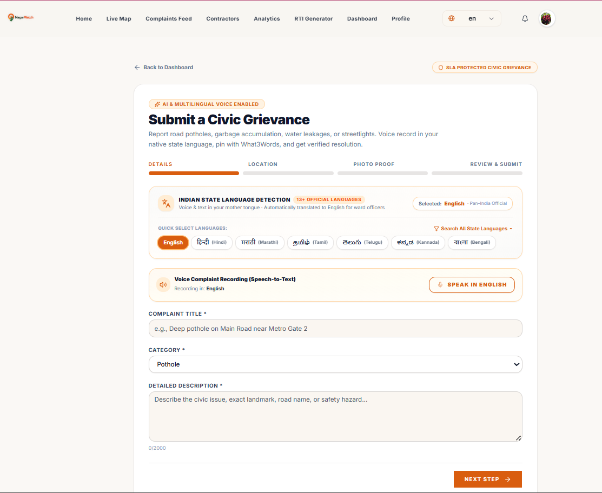
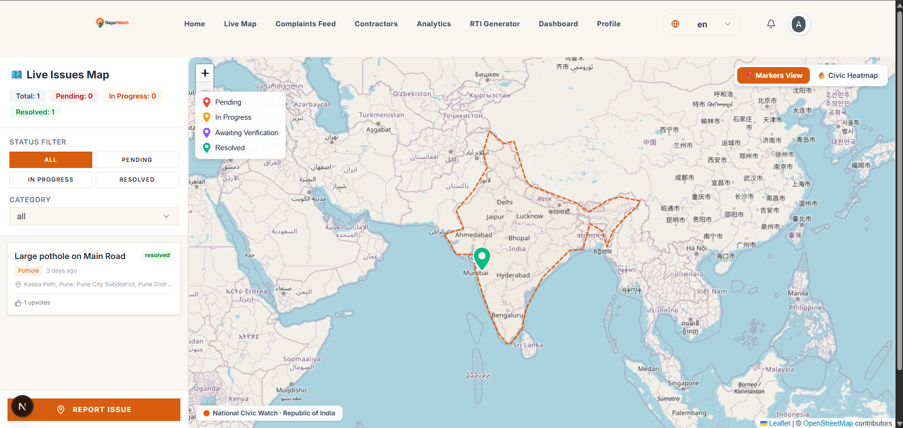
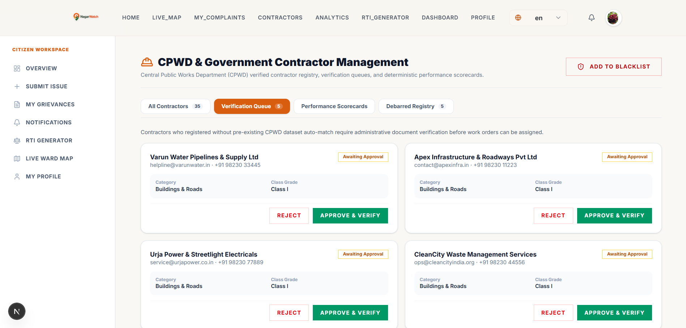
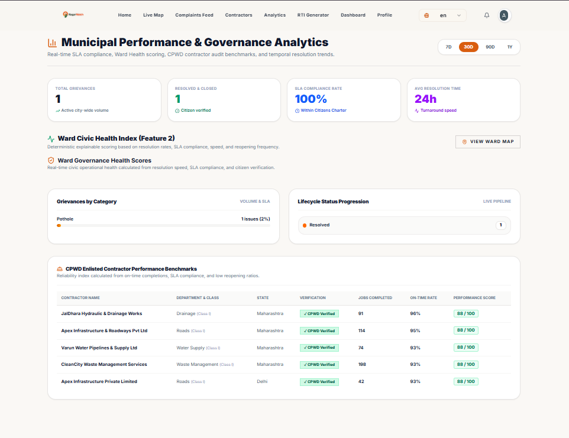

# 🏙️ NagarWatch — Real-Time Civic Issue Reporting & Governance Platform

<p align="center">
  
</p>

> **NagarWatch** is an enterprise-grade, real-time civic issue reporting, tracking, and governance platform engineered specifically for Indian municipalities. It directly bridges citizens, municipal ward authorities, and Central Public Works Department (CPWD) contractors to enforce strict Citizens' Charter SLAs, verified repairs, and complete legal accountability.

[](https://nextjs.org)
[](https://typescriptlang.org)
[](https://react.dev)
[](https://tailwindcss.com)
[](https://nodejs.org)
[](https://expressjs.com)
[](https://www.sarvam.ai)
[](https://clerk.com)
[](https://mongodb.com)
[](https://redis.io)
[](LICENSE)

---

## 📌 Problem Statement

Urban cities across India frequently face chronic, unresolved civic infrastructure breakdowns — deep potholes, overflowing garbage dumps, water supply pipe leakages, hazardous drainage clogs, and dark, non-functioning streetlights. 

Traditional municipal redressal systems suffer from fundamental structural failures:
- **Fragmented Grievance Channels:** Complaints are scattered across disconnected helpline numbers, informal WhatsApp groups, social media tags, and broken municipal portals without a centralized record.
- **Zero Real-Time Visibility:** Citizens receive no automated milestone tracking or GPS visibility after submitting a grievance, leaving them in the dark regarding status or assigned contractors.
- **Redundant & Duplicate Submissions:** Multiple citizens report the same physical pothole or broken pipe, flooding municipal queues with duplicate tickets and wasting public resources.
- **Inefficient Triage & Routing:** Lack of automated priority ranking, department triage, and SLA routing causes urgent public safety hazards to sit unattended.
- **Absence of SLA Enforcement:** No strict Citizens' Charter timeline accountability, resulting in grievances remaining "under review" indefinitely.
- **Unverified Repairs & Ghost Closures:** Field work is routinely marked "Resolved" on government portals without mandatory, objective photographic proof or citizen-side verification.
- **Untracked Municipal Contractors:** Lack of transparent performance metrics, objective quality benchmarking, and automated debarred contractor blacklist enforcement.

---

## 💡 Proposed Solution

**NagarWatch** delivers a modern, transparent civic operating system uniting citizens, municipal authorities, and government contractors in a single synchronized ecosystem:

- **13+ Indian State Languages & Voice Recording:** Citizens file grievances in their native regional language (Hindi, Marathi, Tamil, Telugu, Kannada, Bengali, Gujarati, Malayalam, Punjabi, Odia, Assamese, Urdu, English) using text or voice speech-to-text, auto-translated to English for ward officer triage.
- **Intelligent Geospatial Duplicate Prevention:** MongoDB `$geoNear` 50-meter radius clustering automatically detects existing nearby complaints, giving citizens the option to upvote existing issues rather than duplicating tickets.
- **Sovereign India Live Map & Density Heatmap:** Interactive Leaflet GIS interface strictly bounded to the Republic of India with real-time geospatial markers, density cluster heatmaps, and precise coordinate pinning.
- **Official CPWD Contractor Performance Engine:** Integrated directly with the official Central Public Works Department (CPWD) enlisted contractor database, auditing Class I–V licenses, tracking debarred contractor blacklists, and computing deterministic reliability scorecards (0–100).
- **Citizen Before/After Proof Audit Lifecycle:** Authorities and contractors must upload timestamped resolution photos. Citizens inspect side-by-side Before vs After photo proofs to approve resolution or reopen substandard work with recorded mandatory reasons.
- **Explainable Municipal Ward Health Scoring:** Deterministic 0–100 health index for every municipal ward based on SLA compliance, resolution speed, citizen reopening ratios, and active backlog density.
- **Automated Legal RTI Act 2005 Petitions:** When municipal work exceeds statutory Citizens' Charter SLA deadlines, NagarWatch automatically generates legally formatted Section 6(1) Right to Information (RTI) petitions with instant official PDF download.
- **Instant Real-Time Synchronization:** Socket.IO WebSocket channels keep field officers, map viewers, and citizen dashboards synchronized without manual page refreshes.

---

## 📸 Screenshots

<div align="center">

### 1. Landing Page & Real-Time Civic Intelligence Showcase


<br/><br/>

### 2. Multilingual Civic Grievance Submission (13+ State Languages & Voice STT)


<br/><br/>

### 3. Sovereign India Bounded Live Map & Density Heatmap


<br/><br/>

### 4. Official CPWD Contractor Performance Scorecards & Registry


<br/><br/>

### 5. Municipal Ward Health Index & City Analytics Hub


</div>

---

## ⚡ Key Features

- **Multi-Role Governance Platform:** Role-Based Access Control (RBAC) customized for **Citizens**, **Municipal Authorities**, **CPWD Contractors**, and **System Administrators**.
- **Geospatial Duplicate Detection:** Proactive 50m radius geo-querying prevents redundant ticket submissions and promotes community issue upvoting.
- **Automated Citizens' Charter SLA Engine:** Real-time countdown timers mapped per category (Potholes: 72h, Garbage: 24h, Water Supply: 24h, Streetlights: 48h, Drainage: 36h) with automated escalation triggers.
- **Before vs After Resolution Audit:** Dual photographic matrix with citizen approval/reopen workflow and mandatory reason logging.
- **Canonical Notifications Center:** Real-time in-app alerts, unread filtering, and status milestone tracking across the complaint lifecycle.
- **Community Upvoting & Priority Scoring:** Priority calculation engine blending citizen upvotes, grievance age, severity score, and emergency road factors.
- **RTI Act 2005 Section 6(1) Drafting:** Automated legal drafting of RTI petitions citing Public Information Officers (PIO), complaint IDs, delay duration, and formal inspection requests.

---

## 🌟 Unique Features

- **13+ Official Indian State Languages:** Native script and speech support across Pan-India (`hi-IN`, `mr-IN`, `ta-IN`, `te-IN`, `kn-IN`, `bn-IN`, `gu-IN`, `ml-IN`, `pa-IN`, `od-IN`, `as-IN`, `ur-IN`, `en-IN`) powered by Sarvam AI Indic translation & speech models.
- **Sovereign India Boundary GIS:** Strict geographical bounding ensuring all civic incidents, map panning, and GPS reverse geocoding remain strictly within sovereign Indian territory (`[6.0, 68.0]` to `[37.5, 97.5]`).
- **Official CPWD Contractor Dataset Integration:** Direct integration with official Central Public Works Department contractor datasets, auto-verifying enlistment numbers, classes, contract categories, and debarred blacklists.
- **Deterministic Ward Health Index:** Transparent, explainable 0–100 health scoring formula evaluating on-time SLA rates, resolution velocity, low reopening ratios, and backlog density with diagnostic guidance for municipal commissioners.
- **Contractor Reliability Benchmark:** Objective scorecards based on on-time completion rates, verified repairs, SLA breaches, and historical citizen ratings.

---

## 🛠️ Tech Stack

### Frontend
- **Framework:** [Next.js 15](https://nextjs.org) (App Router, Server Components & Client Hydration)
- **Language:** [TypeScript](https://www.typescriptlang.org) (100% strict type safety)
- **UI Library:** [React 19](https://react.dev)
- **Styling:** [Tailwind CSS](https://tailwindcss.com), [Shadcn UI](https://ui.shadcn.com), [Lucide Icons](https://lucide.dev)
- **Animations:** [Framer Motion](https://www.framer.com/motion/)
- **Mapping & GIS:** [Leaflet](https://leafletjs.com), [React-Leaflet](https://react-leaflet.js.org), [Leaflet.heat](https://github.com/Leaflet/Leaflet.heat), OpenStreetMap
- **State Management:** [Zustand](https://zustand-demo.pmnd.rs)
- **HTTP Client:** [Axios](https://axios-http.com)

### Backend
- **Runtime:** [Node.js 20+](https://nodejs.org)
- **Framework:** [Express.js](https://expressjs.com) with TypeScript
- **Authentication & RBAC:** [Clerk](https://clerk.com) (JWT session verification, metadata role sync)
- **Database:** [MongoDB Atlas](https://www.mongodb.com/atlas) with [Mongoose](https://mongoosejs.com)
- **Caching & Queues:** [Redis](https://redis.io) (Upstash) & [BullMQ](https://bullmq.io)
- **Real-Time WebSockets:** [Socket.IO](https://socket.io) (Bidirectional live synchronization)
- **Media Storage:** [Cloudinary](https://cloudinary.com) (Image & audio uploads via Multer)
- **Indic AI & Multilingual Translation:** [Sarvam AI](https://www.sarvam.ai) (Mayura Indic Translation & Saaras Speech-to-Text)
- **Civic Intelligence:** [Google Gemini AI](https://ai.google.dev) (Category detection, severity estimation, RTI drafting)

---

## 📊 Datasets & API Sources

| Dataset / API | Source / Endpoint | Description |
| :--- | :--- | :--- |
| **CPWD Enlisted Contractors** | [OpenData.best Catalog](https://opendata.best/catalog/in_cpwd_enlisted_contractors) · `https://opendata.best/api/v1/in_cpwd_enlisted_contractors` | Official Central Public Works Department 30-contractor dataset with enlistment numbers, classes, categories, and authority details. |
| **CPWD Debarred Contractors** | Official CPWD Vigilance / Ministry of Housing & Urban Affairs (MoHUA) | Debarred and blacklisted contractor records used for automated integrity verification. |
| **OpenStreetMap & Nominatim** | `https://nominatim.openstreetmap.org/reverse` | High-precision reverse geocoding restricted to Indian sovereign coordinates (`countrycodes=in`). |
| **Republic of India GeoJSON** | Sovereign India Boundary Definition | Precise polygon GeoJSON defining state boundaries and sovereign outer limits of India. |

---

## 📁 Folder Structure

```
NagarWatch/
├── client/                                 # Next.js Frontend Application
│   ├── public/                             # Public static assets, brand banners, icons
│   │   ├── Navbar.png                      # Official platform header banner
│   │   └── favicon.png                     # Platform favicon
│   └── src/
│       ├── app/
│       │   ├── page.tsx                    # Landing page with high-impact stats bar
│       │   ├── (dashboard)/
│       │   │   ├── admin/                  # Admin Hub (Dashboard, Users, Wards, CPWD Contractors)
│       │   │   │   └── analytics/          # Admin Municipal Analytics Hub
│       │   │   ├── authority/              # Authority Dashboard, Complaints & Dispatch
│       │   │   ├── citizen/                # Citizen Dashboard, Submit Grievance, My Issues, RTI
│       │   │   │   └── submit/             # Multilingual Grievance Filing Page
│       │   │   ├── contractor/             # Contractor Task Management & Proof Upload
│       │   │   ├── notifications/          # Centralized Notifications Center
│       │   │   └── profile/                # Universal Profile & Role Management
│       │   ├── (public)/
│       │   │   ├── analytics/              # Public Municipal Analytics & Ward Health
│       │   │   ├── complaints/             # Public Grievances Feed & Verification
│       │   │   ├── contractors/            # Public CPWD Contractor Registry
│       │   │   └── map/                    # Bounded Sovereign India Map & Density Heatmap
│       │   ├── sign-in/                    # Sign-In with Demo Access
│       │   └── sign-up/                    # Sign-Up with RBAC Role Selection
│       ├── components/
│       │   ├── analytics/                  # Municipal Analytics Hub & Ward Scorecards
│       │   ├── auth/                       # Google OAuth Role Selection Modal
│       │   ├── complaints/                 # ComplaintForm, CitizenVerificationCard, NearbyModal
│       │   ├── layout/                     # Navbar, Sidebar, Footer, MobileNav
│       │   └── map/                        # CivicMap, MapPicker, India GeoJSON boundary
│       ├── lib/                            # Axios API client, Socket.IO client, What3Words
│       ├── store/                          # Zustand global state stores
│       └── types/                          # TypeScript interfaces & domain models
│
├── server/                                 # Node.js Express Backend
│   └── src/
│       ├── config/                         # MongoDB, Redis, Cloudinary, Socket.IO
│       ├── middleware/                     # Clerk Auth, RBAC Role Checks, Multer Upload, ErrorHandler
│       ├── models/                         # Complaint, Contractor, Blacklist, User, Ward, Notification
│       ├── routes/                         # Complaints, Analytics, Contractors, AI, Users, Wards
│       ├── seeds/                          # CPWD Contractors & Blacklist Database Seeders
│       └── services/
│           ├── ai/                         # Gemini AI Assistant & Triage Engine
│           ├── analytics/                  # Ward Health Index, Heatmaps, Contractor Performance
│           ├── complaints/                 # Verification & Resolution Lifecycle
│           ├── priority/                   # Dynamic Grievance Priority Calculator
│           ├── transcription/              # Sarvam AI Saaras Speech-to-Text (13+ Languages)
│           ├── translation/                # Sarvam AI Mayura Translation Engine (13+ Languages)
│           └── contractorVerification.service.ts # CPWD Validation Engine
│
└── screenshots/                            # Application Demonstration Screenshots
    ├── LandingPage.png                     # Landing Page Screenshot
    ├── ComplaintPage.png                   # Grievance Submission Form Screenshot
    ├── LiveMap.png                         # Sovereign India Live Map Screenshot
    ├── Contractor.png                      # CPWD Contractor Registry Screenshot
    └── Analytics.png                       # Municipal Analytics Hub Screenshot
```

---

## 🚀 Getting Started

### Prerequisites

Make sure you have the following installed:
- **Node.js**: Version `20.x` or higher
- **npm** or **pnpm**
- **MongoDB**: Local MongoDB instance or free [MongoDB Atlas](https://www.mongodb.com/atlas) cluster
- **Redis**: Local Redis server or free [Upstash Redis](https://upstash.com) instance
- **Clerk Account**: Free account at [Clerk.com](https://clerk.com) for authentication

Optional API Keys:
- **Cloudinary**: For media and photo proof storage
- **Sarvam AI API Key**: For Indic multilingual translation and speech-to-text
- **Google AI Studio Key**: For Gemini AI categorization and RTI generation

---

### Installation

1. **Clone the Repository:**
```bash
git clone https://github.com/AkshatKardak/NagarWatch.git
cd NagarWatch
```

2. **Install Server Dependencies:**
```bash
cd server
npm install
```

3. **Install Client Dependencies:**
```bash
cd ../client
npm install
```

---

### Environment Setup

#### 1. Server Environment Configuration (`server/.env`)
Create a `.env` file in the `server` directory:
```env
PORT=5000
NODE_ENV=development
CLIENT_URL=http://localhost:3000

# MongoDB
MONGO_URI=mongodb+srv://<username>:<password>@cluster.mongodb.net/nagarwatch?retryWrites=true&w=majority

# Redis (Upstash or local)
REDIS_URL=redis://localhost:6379

# Clerk Authentication
CLERK_SECRET_KEY=sk_test_...
CLERK_PUBLISHABLE_KEY=pk_test_...

# Cloudinary Storage
CLOUDINARY_CLOUD_NAME=your_cloud_name
CLOUDINARY_API_KEY=your_api_key
CLOUDINARY_API_SECRET=your_api_secret

# AI & Indic Language Services
GEMINI_API_KEY=your_gemini_key
SARVAM_API_KEY=your_sarvam_key
```

#### 2. Client Environment Configuration (`client/.env.local`)
Create a `.env.local` file in the `client` directory:
```env
NEXT_PUBLIC_API_URL=http://localhost:5000/api
NEXT_PUBLIC_SOCKET_URL=http://localhost:5000

# Clerk Authentication
NEXT_PUBLIC_CLERK_PUBLISHABLE_KEY=pk_test_...
CLERK_SECRET_KEY=sk_test_...
NEXT_PUBLIC_CLERK_SIGN_IN_URL=/sign-in
NEXT_PUBLIC_CLERK_SIGN_UP_URL=/sign-up
NEXT_PUBLIC_CLERK_AFTER_SIGN_IN_URL=/citizen/dashboard
NEXT_PUBLIC_CLERK_AFTER_SIGN_UP_URL=/citizen/dashboard
```

---

### Running the Application

1. **Seed the CPWD Contractors Database (First Time Only):**
```bash
cd server
npm run seed:contractors
```

2. **Start the Backend Server:**
```bash
cd server
npm run dev
# Server will run on http://localhost:5000
```

3. **Start the Next.js Frontend:**
```bash
cd client
npm run dev
# Client will run on http://localhost:3000
```

4. **Access NagarWatch:** Open [http://localhost:3000](http://localhost:3000) in your web browser.

---

## 🍴 Forking & Contributing Guide

Contributions are welcome! Follow these steps to contribute:

1. **Fork the Repository:** Click the **Fork** button at the top right of this page.
2. **Clone your Fork:**
```bash
git clone https://github.com/<your-username>/NagarWatch.git
cd NagarWatch
```
3. **Create a Feature Branch:**
```bash
git checkout -b feature/amazing-feature
```
4. **Make Your Changes & Test:**
```bash
# Verify client build
cd client && npx tsc --noEmit

# Verify server build
cd ../server && npx tsc --noEmit
```
5. **Commit Your Changes:**
```bash
git commit -m "feat: add amazing feature description"
```
6. **Push to Your Fork:**
```bash
git push origin feature/amazing-feature
```
7. **Open a Pull Request:** Navigate to the original repository and open a Pull Request explaining your changes.

---

## 📜 License

This project is licensed under the **MIT License** — see the [LICENSE](LICENSE) file for full details.

---

## 👨‍💻 Creator & Author

**Akshat Kardak**
- **GitHub:** [@AkshatKardak](https://github.com/AkshatKardak)
- **Project Repository:** [https://github.com/AkshatKardak/NagarWatch](https://github.com/AkshatKardak/NagarWatch)

---

<p align="center">
  <b>NagarWatch</b> — Empowering Indian Citizens with Sovereign Civic Governance &amp; SLA Transparency 🇮🇳
</p>
